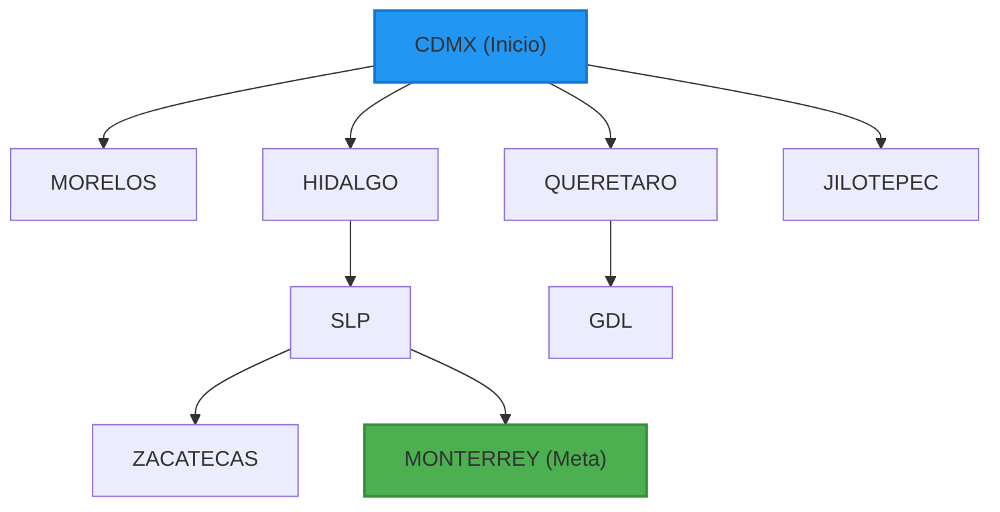

# Documentación Completa y Cronología del Proyecto LyAII (Recuperación)

Este manual consolida la documentación de todos los módulos del proyecto, organizados en tres unidades temáticas principales que describen los objetivos, fundamentos teóricos, código fuente completo de los componentes y las guías de pruebas y ejecución asociadas.

---

## Índice General del Proyecto

### [Unidad 1: Búsqueda No Informada sobre Grafos](file:///home/paimon/Escritorio/LyAII_Recuperacion/examen_LYArec/manuales/unidad_1.md)
* **BFS (Breadth-First Search)**: Buscador de rutas óptimas en cantidad de arcos entre ciudades de la República Mexicana.

### [Unidad 2: Métodos de Búsqueda y Algoritmos en Espacios de Estados Complejos](file:///home/paimon/Escritorio/LyAII_Recuperacion/examen_LYArec/manuales/unidad_2.md)
* **Puzzle lineal BFS**: Resolución del rompecabezas lineal de 4 dígitos usando Búsqueda en Anchura con swaps adyacentes.
* **Vuelos_bpi**: Buscador de trayectos aéreos óptimos utilizando Búsqueda con Profundidad Iterativa (IDDFS).
* **Carretera_usc**: Planificador de rutas de costo mínimo en distancias físicas acumuladas usando Costo Uniforme (Dijkstra).
* **Puzzle heurística**: resolvedor del puzzle de 4 dígitos acelerado mediante heurística de celdas fuera de lugar y cola de prioridades.
* **PLE Backtracking**: Optimizador de Programación Lineal Entera mediante búsqueda en espacio de estados en profundidad y poda selectiva.

### [Unidad 3: Búsqueda Informada Avanzada e Inteligencia Logística](file:///home/paimon/Escritorio/LyAII_Recuperacion/examen_LYArec/manuales/unidad_3.md)
* **Carretera_costo_coords**: Búsqueda óptima de rutas terrestres utilizando el algoritmo A* guiado por la heurística de distancia geodésica.
* **A* Llantas**: Asignador óptimo de proveedores de neumáticos sin repetir empresa mediante búsqueda heurística A* y estimación admisible.
* **VRP_voraz**: Algoritmo de ahorros voraz de Clarke y Wright para ruteo y consolidación de despachos vehiculares bajo límite de capacidad de carga.

---

# Unidad 1: Búsqueda No Informada sobre Grafos

## 1. BFS (Breadth-First Search) - Buscador de Rutas en Ciudades de México

### Objetivo
Implementar un resolvedor de caminos entre ciudades mexicanas utilizando el algoritmo de **Búsqueda en Anchura (BFS)** sobre un grafo representado a nivel de código, permitiendo la integración de consultas rápidas de caminos mínimos en cantidad de tramos desde un servidor Flask y visualización dinámica.

### Fundamento Teórico
La **Búsqueda en Anchura (BFS)** es un algoritmo de búsqueda no informada que expande los nodos del grafo nivel por nivel de manera uniforme. En grafos no ponderados (o donde el costo de transición entre nodos se considera equivalente a 1 salto), BFS garantiza encontrar el camino con la menor cantidad de conexiones intermedias. 

El algoritmo utiliza una estructura de **Cola (FIFO - First-In First-Out)** para gestionar la frontera de búsqueda. El proceso es:
1. Insertar el nodo inicial en la frontera y marcarlo como descubierto.
2. Mientras la frontera no esté vacía, extraer el primer elemento (el más antiguo).
3. Evaluar si es el nodo destino. Si lo es, reconstruir el camino hacia atrás.
4. Si no es el destino, expandir todos sus hijos no visitados, insertándolos al final de la frontera.



### Clase de Soporte Común (`arbol.py`)
```python
# arbol.py
class Nodo:
    def __init__(self, datos, padre=None, hijos=None):
        self.datos = datos
        self.padre = padre
        self.hijos = None
        self.costo = None
        self.set_hijos(hijos)

    def set_hijos(self, hijos):
        self.hijos = hijos
        if self.hijos is not None:
            for h in self.hijos:
                h.padre = self

    def get_hijos(self): return self.hijos
    def get_datos(self): return self.datos
    def get_padre(self): return self.padre
    def set_datos(self, datos): self.datos = datos
    def set_costo(self, costo): self.costo = costo
    def get_costo(self): return self.costo

    def igual(self, nodo):
        return self.get_datos() == nodo.get_datos()

    def en_lista(self, lista_nodos):
        for n in lista_nodos:
            if self.igual(n): return True
        return False

    def __str__(self): return str(self.get_datos())
```

### Algoritmo BFS en Grafo (`BFS.py`)
```python
# BFS.py
from arbol import Nodo

conexiones = {
    'CDMX': {'MORELOS': 85, 'HIDALGO': 90, 'QUERETARO': 210, 'JILOTEPEC': 100},
    'JILOTEPEC': {'CDMX': 100, 'HIDALGO': 80, 'QUERETARO': 110},
    'HIDALGO': {'CDMX': 90, 'JILOTEPEC': 80, 'SLP': 300, 'QUERETARO': 200, 'TAMAULIPAS': 450},
    'QUERETARO': {'CDMX': 210, 'JILOTEPEC': 110, 'HIDALGO': 200, 'SLP': 200, 'GDL': 350},
    'MORELOS': {'CDMX': 85},
    'SLP': {'HIDALGO': 300, 'QUERETARO': 200, 'ZACATECAS': 190, 'MONTERREY': 500, 'TAMAULIPAS': 350},
    'ZACATECAS': {'SLP': 190, 'GDL': 320, 'MONTERREY': 460},
    'GDL': {'QUERETARO': 350, 'ZACATECAS': 320},
    'MONTERREY': {'SLP': 500, 'ZACATECAS': 460, 'TAMAULIPAS': 280},
    'TAMAULIPAS': {'SLP': 350, 'MONTERREY': 280, 'HIDALGO': 450}
}

def buscar_solucion_BFS_grafo(grafo, estado_inicial, solucion):
    nodos_visitados = []
    nodos_frontera = []
    
    nodoInicial = Nodo(estado_inicial)
    nodoInicial.set_costo(0)
    nodos_frontera.append(nodoInicial)

    if estado_inicial == solucion:
        return nodoInicial

    while len(nodos_frontera) != 0:
        nodos_frontera.sort(key=lambda x: x.costo)
        nodo = nodos_frontera.pop(0)
        nodos_visitados.append(nodo)

        if nodo.get_datos() == solucion: return nodo

        dato_nodo = nodo.get_datos()
        hijos_datos = grafo[dato_nodo] if dato_nodo in grafo else {}

        for un_hijo, peso in hijos_datos.items():
            hijo = Nodo(un_hijo, padre=nodo)
            hijo.set_costo(nodo.costo + peso)

            if not hijo.en_lista(nodos_visitados):
                agregado = False
                for n in nodos_frontera:
                    if n.get_datos() == un_hijo:
                        if hijo.costo < n.costo:
                            n.set_costo(hijo.costo)
                            n.set_padre(nodo)
                        agregado = True
                        break
                if not agregado:
                    nodos_frontera.append(hijo)
    return None

def buscar_solucion_BFS(estado_inicial, solucion):
    return buscar_solucion_BFS_grafo(conexiones, estado_inicial, solucion)
```

---

# Unidad 2: Métodos de Búsqueda y Algoritmos en Espacios de Estados Complejos

## 1. Puzzle Lineal BFS

### Objetivo
Resolver el rompecabezas de ordenamiento lineal de 4 dígitos (estado inicial `[4, 2, 3, 1]` a estado meta `[1, 2, 3, 4]`) utilizando el algoritmo de **Búsqueda en Anchura (BFS)** con operadores de movimiento adyacente.

### Fundamento Teórico
El problema consiste en ordenar una secuencia de números mediante operaciones permitidas de intercambios (*swaps*) entre elementos adyacentes. Definimos tres operaciones de intercambio:
- **Operador Izquierdo**: Intercambia los elementos en las posiciones 0 y 1.
- **Operador Central**: Intercambia los elementos en las posiciones 1 y 2.
- **Operador Derecho**: Intercambia los elementos en las posiciones 2 y 3.

BFS explora todos los estados posibles en orden de profundidad creciente (nivel por nivel), garantizando la solución con la menor cantidad posible de movimientos.

### Código del Puzzle Lineal
```python
def buscar_solucion_BFS_puzzle(estado_inicial, solucion):
    nodos_visitados = []
    nodos_frontera = [Nodo(estado_inicial)]

    while len(nodos_frontera) != 0:
        nodo = nodos_frontera.pop(0)
        nodos_visitados.append(nodo)
        if nodo.get_datos() == solucion: return nodo
        
        dato_nodo = nodo.get_datos()
        hijos_datos = [
            [dato_nodo[1], dato_nodo[0], dato_nodo[2], dato_nodo[3]], # swap 0-1
            [dato_nodo[0], dato_nodo[2], dato_nodo[1], dato_nodo[3]], # swap 1-2
            [dato_nodo[0], dato_nodo[1], dato_nodo[3], dato_nodo[2]]  # swap 2-3
        ]
        for un_hijo in hijos_datos:
            hijo = Nodo(un_hijo, padre=nodo)
            if not hijo.en_lista(nodos_visitados) and not hijo.en_lista(nodos_frontera):
                nodos_frontera.append(hijo)
    return None
```

---

## 2. Vuelos_bpi (Búsqueda de Profundidad Iterativa / IDDFS)

### Objetivo
Diseñar y programar un buscador de vuelos con escalas entre aeropuertos mexicanos aplicando la estrategia de **Búsqueda con Profundidad Iterativa (BPI)**.

### Fundamento Teórico
La **Búsqueda de Profundidad Iterativa (IDDFS)** funciona ejecutando repetidamente una búsqueda en profundidad limitada (`limite`), incrementando la profundidad máxima de 1 en 1 en cada iteración. Combina los bajos requisitos de memoria de DFS con la optimalidad en saltos de BFS.

### Código de Búsqueda Iterativa (`Vuelos_BPI.py`)
```python
# Vuelos_BPI.py
from arbol import Nodo

conexiones = {
    'Jiloyork': {'Celaya', 'CDMX', 'Querétaro'},
    'Sonora': {'Zacatecas', 'Sinaloa'},
    'Guanajuato': {'Aguascalientes'},
    'Oaxaca': {'Querétaro'},
    'Sinaloa': {'Celaya', 'Sonora', 'Jiloyork'},
    'Querétaro': {'Monterrey', 'Tamaulipas', 'Zacatecas', 'Sinaloa', 'Jiloyork', 'Oaxaca'},
    'Celaya': {'Jiloyork', 'Sinaloa'},
    'Zacatecas': {'Sonora', 'Monterrey', 'Querétaro'},
    'Monterrey': {'Zacatecas', 'Sinaloa'},
    'Tamaulipas': {'Querétaro'}
}

def DFS_prof_iter(nodo, solucion):
    for limite in range(0, 100):
        visitados = []
        sol = buscar_solucion_DFS_Rec(nodo, solucion, visitados, limite)
        if sol != None: return sol
    return None
        
def buscar_solucion_DFS_Rec(nodo, solucion, visitados, limite):
    if limite > 0:
        visitados.append(nodo)
        if nodo.get_datos() == solucion: return nodo
        
        dato_nodo = nodo.get_datos()
        lista_hijos = []
        if dato_nodo in conexiones:
            for un_hijo in conexiones[dato_nodo]:
                hijo = Nodo(un_hijo)
                if not hijo.en_lista(visitados): lista_hijos.append(hijo)
        
        nodo.set_hijos(lista_hijos)
        for nodo_hijo in nodo.get_hijos():
            if not nodo_hijo.get_datos() in [v.get_datos() for v in visitados]:
                sol = buscar_solucion_DFS_Rec(nodo_hijo, solucion, visitados, limite-1)
                if sol != None:
                    nodo_hijo.padre = nodo
                    return sol
    return None
```

---

## 3. Carretera_usc (Uniform Cost Search - Costo Uniforme)

### Objetivo
Determinar la ruta óptima de menor distancia en kilómetros reales acumulados entre dos ciudades de México aplicando el algoritmo de **Búsqueda de Costo Uniforme (UCS)**.

### Fundamento Teórico
UCS expande siempre el nodo con menor costo acumulado $g(n)$ desde el origen, empleando una lista ordenada ascendentemente por costo acumulado en cada paso.

### Código de Costo Uniforme (`Carretera_UCS.py`)
```python
# Carretera_UCS.py
from arbol import Nodo

conexiones = {
    'JILOYORK': {'CDMX': 125, 'QRO': 513},
    'MORELOS': {'QRO': 524},
    'CDMX': {'JILOYORK': 125, 'QRO': 423, 'HGO': 491},
    'HGO': {'CDMX': 491, 'QRO': 356, 'MEXICALI': 109, 'MONTERREY': 346},
    'QRO': {
        'SLP': 203, 'MORELOS': 514, 'JILOYORK': 513, 'CDMX': 423,
        'MONTERREY': 603, 'SONORA': 437, 'HGO': 356, 'MEXICALI': 313,
        'AGUASCALIENTES': 599
    },
    'SLP': {'AGUASCALIENTES': 399, 'QRO': 203},
    'AGUASCALIENTES': {'SLP': 390, 'QRO': 599},
    'SONORA': {'QRO': 437, 'MEXICALI': 394},
    'MEXICALI': {'MONTERREY': 296, 'HGO': 309, 'QRO': 313},
    'MONTERREY': {'MEXICALI': 296, 'QRO': 603, 'HGO': 346}
}

def buscar_solucion_UCS(estado_inicial, solucion):
    nodos_visitados = []
    nodos_frontera = [Nodo(estado_inicial)]
    nodos_frontera[0].set_costo(0)

    while len(nodos_frontera) > 0:
        nodos_frontera = sorted(nodos_frontera, key=lambda x: x.costo)
        nodo = nodos_frontera.pop(0)
        nodos_visitados.append(nodo.get_datos())
        
        if nodo.get_datos() == solucion: return nodo
        
        dato_nodo = nodo.get_datos()
        if dato_nodo in conexiones:
            lista_hijos = []
            for un_hijo, costo in conexiones[dato_nodo].items():
                hijo = Nodo(un_hijo, nodo)
                hijo.set_costo(nodo.costo + costo)
                
                if un_hijo not in nodos_visitados:
                    en_frontera = False
                    for n in nodos_frontera:
                        if n.get_datos() == un_hijo:
                            en_frontera = True
                            if n.costo > hijo.costo:
                                nodos_frontera.remove(n)
                                nodos_frontera.append(hijo)
                            break
                    if not en_frontera:
                        nodos_frontera.append(hijo)
                        lista_hijos.append(hijo)
            nodo.set_hijos(lista_hijos)
    return None
```

---

## 4. Puzzle Heurística (Piezas Fuera de Lugar)

### Objetivo
Resolver el rompecabezas lineal de 4 dígitos utilizando una función heurística de **piezas fuera de lugar** para acelerar la velocidad de búsqueda.

### Fundamento Teórico
Asigna una prioridad a cada nodo basada en la heurística:
$$h(n) = \text{Número de dígitos que no se encuentran en su posición objetivo final.}$$
Se emplea una cola de prioridad (`heapq`) para expandir primero los estados menos desordenados.

### Código del Puzzle Heurístico (`puzzleLinealHeuistico.py`)
```python
# puzzleLinealHeuistico.py
from arbol import Nodo
import heapq

def heuristic(estado, estado_final):
    distancia = 0
    for i in range(len(estado)):
        if estado[i] != estado_final[i]: distancia += 1
    return distancia

def buscar_solucion_heuristica(nodo_inicial, estado_final):
    visitados = set()
    counter = 0
    prioridad_inicial = heuristic(nodo_inicial.get_datos(), estado_final)
    queue = [(prioridad_inicial, counter, nodo_inicial)]
    visitados.add(tuple(nodo_inicial.get_datos()))
    
    while queue:
        prioridad, _, nodo_actual = heapq.heappop(queue)
        if nodo_actual.get_datos() == estado_final: return nodo_actual
        
        dato_nodo = nodo_actual.get_datos()
        hijos_datos = [
            [dato_nodo[1], dato_nodo[0], dato_nodo[2], dato_nodo[3]], # swap 0-1
            [dato_nodo[0], dato_nodo[2], dato_nodo[1], dato_nodo[3]], # swap 1-2
            [dato_nodo[0], dato_nodo[1], dato_nodo[3], dato_nodo[2]]  # swap 2-3
        ]
        lista_hijos = []
        for h_dato in hijos_datos:
            if tuple(h_dato) not in visitados:
                visitados.add(tuple(h_dato))
                hijo_nodo = Nodo(h_dato, padre=nodo_actual)
                lista_hijos.append(hijo_nodo)
                h_val = heuristic(h_dato, estado_final)
                counter += 1
                heapq.heappush(queue, (h_val, counter, hijo_nodo))
        nodo_actual.set_hijos(lista_hijos)
    return None
```

---

## 5. PLE Backtracking (Programación Lineal Entera)

### Objetivo
Maximizar una función de producción comercial para variables de decisión enteras, empleando **Backtracking** y podas por límites de recursos.

### Fundamento Teórico
Resuelve:
$$\text{Maximizar } Z = b_1 \cdot x_1 + b_2 \cdot x_2$$
Sujeto a restricciones de recursos. Evalúa recursivamente las variables enteras y poda el subárbol completo si los valores parciales exceden las restricciones, retrocediendo (backtrack) para evaluar alternativas.

### Código de Backtracking (`dfs_backtraking.py`)
```python
# dfs_backtraking.py
class BacktrackingOptimizer:
    def __init__(self, ranges=None, beneficios=(6, 4), limites=(150, 160), coefs=((7, 4), (6, 5))):
        self.mejor_val = -1
        self.mejor_sol = None
        self.rango_variables = ranges if ranges else [(0, 50), (0, 75)]
        self.beneficios = beneficios
        self.limites = limites
        self.coefs = coefs

    def es_completable(self, variables):
        x1, x2 = variables
        val1 = self.coefs[0][0] * x1 + self.coefs[0][1] * x2
        val2 = self.coefs[1][0] * x1 + self.coefs[1][1] * x2
        return val1 <= self.limites[0] and val2 <= self.limites[1]

    def evalua_solucion(self, variables):
        return self.beneficios[0] * variables[0] + self.beneficios[1] * variables[1]

    def resolver(self, variables, profundidad):
        if profundidad == len(variables):
            val = self.evalua_solucion(variables)
            if val > self.mejor_val:
                self.mejor_val = val
                self.mejor_sol = list(variables)
            return

        min_val, max_val = self.rango_variables[profundidad]
        for v in range(int(min_val), int(max_val) + 1):
            nuevas_variables = list(variables)
            nuevas_variables[profundidad] = v
            
            if self.es_completable(nuevas_variables):
                self.resolver(nuevas_variables, profundidad + 1)
            else:
                break
```

---

# Unidad 3: Búsqueda Informada Avanzada e Inteligencia Logística

## 1. Carretera_costo_coords (Carretera A\*)

### Objetivo
Resolver la navegación terrestre óptima empleando el algoritmo **A\*** y la distancia geodésica entre coordenadas geográficas (latitud, longitud) como heurística admisible $h(n)$.

### Fundamento Teórico
A\* evalúa nodos con $f(n) = g(n) + h(n)$. $g(n)$ es la distancia real en kilómetros de la carretera y $h(n)$ es la distancia en línea recta geodésica (Haversine) hasta la meta. Esta estimación optimista nunca sobreestima el costo real, garantizando la optimalidad y reduciendo drásticamente los nodos expandidos.

### Código de Carretera A\* (`Carretera_Astar.py`)
```python
# Carretera_Astar.py
from arbol import Nodo
from math import sin, cos, acos

conexiones = {
    'Jiloyork':{'CDMX': 125, 'QRO':513},
    'MORELOS':{'QRO':524},
    'CDMX':{'Jiloyork': 125, 'QRO':423, 'HGO':491},
    'HGO':{'CDMX':491, 'QRO':356, 'MEXICALI':309, 'MTY':346},
    'QRO':{'SLP':203, 'MORELOS':514, 'Jiloyork':513, 'CDMX':423, 'MTY':603,\
            'SONORA':437, 'HGO':356, 'MEXICALI':313, 'AGS':599},
    'SLP':{'AGS':390, 'QRO':203},
    'AGS':{'SLP':390, 'QRO':599},
    'SONORA':{'QRO':437, 'MEXICALI':394},
    'MEXICALI':{'MTY':296, 'HGO':309, 'QRO':313},
    'MTY':{'MEXICALI':296, 'QRO':603, 'HGO':346}
}

coord = {
    'Jiloyork':(19.9524089, -99.5330457),
    'CDMX':(19.4326849, -99.1333370),
    'QRO':(20.5879565, -100.3879329),
    'MORELOS':(18.9305559, -99.2223779),
    'HGO':(20.1270000, -98.7315641),
    'AGS':(21.8561507, -102.2891565),
    'SLP':(22.1517492, -100.9764345),
    'SONORA':(29.0786585, -110.9476076),
    'MEXICALI':(29.0786585, -110.9476076),
    'MTY':(25.6661606, -100.3288081)
}

def geodist(lat1, lon1, lat2, lon2):
    grad_rad = 0.0174539
    rad_grad = 57.29577951
    longitud = lon1 - lon2
    val = (sin(lat1 * grad_rad) * sin(lat2 * grad_rad)) + (cos(lat1 * grad_rad) * cos(lat2 * grad_rad) * cos(longitud * grad_rad))
    val = max(-1.0, min(1.0, val))
    return (acos(val) * rad_grad) * 111.32

def buscar_solucion_USC(conexiones, estado_inicial, solucion):
    def evalua(x):
        lat1 = coord[x.get_datos()][0]
        lon1 = coord[x.get_datos()][1]
        lat2 = coord[solucion][0]
        lon2 = coord[solucion][1]
        d = int(geodist(lat1, lon1, lat2, lon2))
        return x.get_costo() + d

    nodos_visitados = []
    nodos_frontera = [Nodo(estado_inicial)]
    nodos_frontera[0].set_costo(0)
    
    while len(nodos_frontera) != 0:
        nodos_frontera = sorted(nodos_frontera, key=evalua)
        nodo = nodos_frontera.pop(0)
        nodos_visitados.append(nodo)
        
        if nodo.get_datos() == solucion: return nodo
        
        dato_nodo = nodo.get_datos()
        if dato_nodo in conexiones:
            for un_hijo in conexiones[dato_nodo]:
                hijo = Nodo(un_hijo, nodo)
                costo = conexiones[dato_nodo][un_hijo]
                hijo.set_costo(nodo.get_costo() + costo)
                
                if not hijo.en_lista(nodos_visitados):
                    en_frontera = False
                    for n in nodos_frontera:
                        if n.igual(hijo):
                            en_frontera = True
                            if n.get_costo() > hijo.get_costo():
                                nodos_frontera.remove(n)
                                nodos_frontera.append(hijo)
                            break
                    if not en_frontera: nodos_frontera.append(hijo)
    return None
```

---

## 2. A\* Llantas (Selección de Ruedas)

### Objetivo
Resolver la compra óptima de 4 tipos de ruedas en 4 empresas diferentes con costo mínimo utilizando el algoritmo **A\***, sin repetir proveedores.

### Fundamento Teórico
Implementa A\* con:
- **g(n)**: Costo acumulado de los neumáticos adquiridos.
- **h(n)**: Suma de los precios mínimos ofrecidos por las empresas disponibles restantes para las ruedas pendientes. Garantiza admisibilidad y consistencia en la búsqueda.

### Código de Selección de Neumáticos A\* (`SeleccionRuedas_Astar.py`)
```python
# SeleccionRuedas_Astar.py
from arbol import Nodo

TIPOS_RUEDA = ['t', 'h', 'v', 'w']
EMPRESAS = ['Empresa 1', 'Empresa 2', 'Empresa 3', 'Empresa 4']

def calcular_h(estado, matriz):
    empresas_asignadas = set(emp for emp in estado if emp is not None)
    empresas_libres = [emp for emp in EMPRESAS if emp not in empresas_asignadas]
    
    if not empresas_libres: return 0, []
        
    h_total = 0
    for i in range(len(TIPOS_RUEDA)):
        if estado[i] is None:
            tipo_rueda = TIPOS_RUEDA[i]
            precio_min = min(matriz[emp][tipo_rueda] for emp in empresas_libres)
            h_total += precio_min
    return h_total, []

def resolver_seleccion_ruedas(matriz):
    estado_inicial = [None, None, None, None]
    nodo_raiz = Nodo(estado_inicial)
    nodo_raiz.set_costo(0)
    nodo_raiz.h, _ = calcular_h(estado_inicial, matriz)
    nodo_raiz.f = nodo_raiz.h
    nodo_raiz.depth = 0
    
    frontera = [nodo_raiz]
    visitados = []
    
    while len(frontera) > 0:
        frontera.sort(key=lambda x: (x.f, -x.depth))
        nodo_actual = frontera.pop(0)
        visitados.append(nodo_actual)
        
        if nodo_actual.depth == 4: return nodo_actual
            
        rueda_por_asignar = TIPOS_RUEDA[nodo_actual.depth]
        empresas_ocupadas = set(emp for emp in nodo_actual.get_datos() if emp is not None)
        empresas_disponibles = [emp for emp in EMPRESAS if emp not in empresas_ocupadas]
        
        for emp in empresas_disponibles:
            nuevo_estado = list(nodo_actual.get_datos())
            nuevo_estado[nodo_actual.depth] = emp
            
            nodo_hijo = Nodo(nuevo_estado, padre=nodo_actual)
            costo_g = nodo_actual.get_costo() + matriz[emp][rueda_por_asignar]
            nodo_hijo.set_costo(costo_g)
            
            h_hijo, _ = calcular_h(nuevo_estado, matriz)
            nodo_hijo.f = costo_g + h_hijo
            nodo_hijo.depth = nodo_actual.depth + 1
            
            ya_visitado = any(v.get_datos() == nuevo_estado for v in visitados)
            if not ya_visitado:
                en_frontera = False
                for n in frontera:
                    if n.get_datos() == nuevo_estado:
                        en_frontera = True
                        if n.get_costo() > costo_g:
                            frontera.remove(n)
                            frontera.append(nodo_hijo)
                        break
                if not en_frontera: frontera.append(nodo_hijo)
    return None
```

---

## 3. VRP_voraz (Vehicle Routing Problem)

### Objetivo
Planificar el despacho de pedidos a clientes desde un almacén central bajo límite de capacidad operativa de los vehículos utilizando el **Algoritmo de Ahorros de Clarke y Wright**.

### Fundamento Teórico
Calcula el ahorro de unir dos clientes $i, j$ en una misma ruta en lugar de atenderlos por separado:
$$S(i, j) = d(i, 0) + d(j, 0) - d(i, j)$$
Los ahorros se ordenan descendentemente y se fusionan las rutas de reparto iterativamente cuidando no sobrepasar el límite de capacidad de carga del vehículo.

### Código del Algoritmo VRP Voraz (`BRP_boraz.py`)
```python
# BRP_boraz.py
from Carretera_Astar import coord
import math
from operator import itemgetter

def distancia(coord1, coord2):
    return math.sqrt((coord1[0]-coord2[0])**2 + (coord1[1]-coord2[1])**2)

def en_ruta(rutas, cliente):
    for n in rutas:
        if cliente in n: return n
    return None

def peso_ruta(ruta, pedidos):
    return sum(pedidos[c] for c in ruta if c in pedidos)

def vrp_voraz(pedidos, almacen, max_carga):
    s = {}
    clientes = list(pedidos.keys())
    
    # Calcular ahorros
    for c1 in clientes:
        for c2 in clientes:
            if c1 != c2 and not (c1, c2) in s and not (c2, c1) in s:
                d_c1_c2 = distancia(coord[c1], coord[c2])
                d_c1_alm = distancia(coord[c1], coord[almacen])
                d_c2_alm = distancia(coord[c2], coord[almacen])
                s[(c1, c2)] = d_c1_alm + d_c2_alm - d_c1_c2
                    
    s = sorted(s.items(), key=itemgetter(1), reverse=True)
    rutas = []
    pasos = []
    
    for k, v in s:
        rc1 = en_ruta(rutas, k[0])
        rc2 = en_ruta(rutas, k[1])
        
        if rc1 is None and rc2 is None:
            if peso_ruta([k[0], k[1]], pedidos) <= max_carga:
                rutas.append([k[0], k[1]])
                pasos.append(f"Regla 1: Ruta creada con {k[0]} y {k[1]} (Ahorro: {v:.2f}).")
        elif rc1 is not None and rc2 is None:
            if rc1[0] == k[0] and peso_ruta(rc1, pedidos) + pedidos[k[1]] <= max_carga:
                rutas[rutas.index(rc1)].insert(0, k[1])
                pasos.append(f"Regla 2: {k[1]} añadido al inicio de {rc1}.")
            elif rc1[-1] == k[0] and peso_ruta(rc1, pedidos) + pedidos[k[1]] <= max_carga:
                rutas[rutas.index(rc1)].append(k[1])
                pasos.append(f"Regla 2: {k[1]} añadido al final de {rc1}.")
        elif rc1 is None and rc2 is not None:
            if rc2[0] == k[1] and peso_ruta(rc2, pedidos) + pedidos[k[0]] <= max_carga:
                rutas[rutas.index(rc2)].insert(0, k[0])
                pasos.append(f"Regla 2: {k[0]} añadido al inicio de {rc2}.")
            elif rc2[-1] == k[1] and peso_ruta(rc2, pedidos) + pedidos[k[0]] <= max_carga:
                rutas[rutas.index(rc2)].append(k[0])
                pasos.append(f"Regla 2: {k[0]} añadido al final de {rc2}.")
        elif rc1 is not None and rc2 is not None and rc1 != rc2:
            if rc1[0] == k[0] and rc2[-1] == k[1] and peso_ruta(rc1, pedidos) + peso_ruta(rc2, pedidos) <= max_carga:
                rutas[rutas.index(rc2)].extend(rc1)
                rutas.remove(rc1)
                pasos.append(f"Regla 3: Unificadas rutas de {k[1]} y {k[0]}.")
            elif rc1[-1] == k[0] and rc2[0] == k[1] and peso_ruta(rc1, pedidos) + peso_ruta(rc2, pedidos) <= max_carga:
                rutas[rutas.index(rc1)].extend(rc2)
                rutas.remove(rc2)
                pasos.append(f"Regla 3: Unificadas rutas de {k[0]} y {k[1]}.")
                    
    for c in clientes:
        if en_ruta(rutas, c) is None:
            rutas.append([c])
            pasos.append(f"Regla 4: Cliente {c} en ruta individual.")
        
    return rutas, pasos
```
