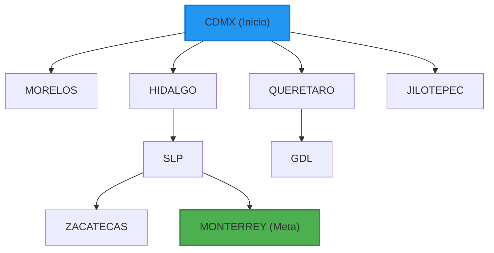

# Unidad 1: Búsqueda No Informada sobre Grafos

Esta unidad aborda la implementación básica de la **Búsqueda en Anchura (BFS - Breadth-First Search)** estructurando y resolviendo búsquedas de caminos óptimos en cantidad de conexiones (saltos) sobre grafos de representación espacial.

---

## 1. BFS (Breadth-First Search) - Buscador de Rutas en Ciudades de México

### 1.1 Objetivo
Implementar un resolvedor de caminos entre ciudades mexicanas utilizando el algoritmo de **Búsqueda en Anchura (BFS)** sobre un grafo representado a nivel de código, permitiendo la integración de consultas rápidas de caminos mínimos en cantidad de tramos desde un servidor Flask y visualización dinámica.

### 1.2 Fundamento Teórico
La **Búsqueda en Anchura (BFS)** es un algoritmo de búsqueda no informada que expande los nodos del grafo nivel por nivel de manera uniforme. En grafos no ponderados (o donde el costo de transición entre nodos se considera equivalente a 1 salto), BFS garantiza encontrar el camino con la menor cantidad de conexiones intermedias. 

El algoritmo utiliza una estructura de **Cola (FIFO - First-In First-Out)** para gestionar la frontera de búsqueda. El proceso es:
1. Insertar el nodo inicial en la frontera y marcarlo como descubierto.
2. Mientras la frontera no esté vacía, extraer el primer elemento (el más antiguo).
3. Evaluar si es el nodo destino. Si lo es, reconstruir el camino hacia atrás.
4. Si no es el destino, expandir todos sus hijos no visitados, insertándolos al final de la frontera.



---

### 1.3 Estructura del Código

#### Clase de Soporte Común (`arbol.py`)
Esta clase modela la estructura de árbol de búsqueda y es reutilizada por todos los algoritmos del proyecto para almacenar los estados, las relaciones jerárquicas y los costos de los nodos.

```python
# arbol.py
# Clase base para representar los nodos en el árbol de búsqueda

class Nodo:
    def __init__(self, datos, padre=None, hijos=None):
        self.datos = datos
        self.padre = padre
        self.hijos = None
        self.costo = None
        self.set_hijos(hijos)

    def set_hijos(self, hijos):
        self.hijos = hijos
        if self.hijos is not None:
            for h in self.hijos:
                h.padre = self

    def get_hijos(self):
        return self.hijos

    def get_datos(self):
        return self.datos

    def get_padre(self):
        return self.padre

    def set_datos(self, datos):
        self.datos = datos

    def set_costo(self, costo):
        self.costo = costo

    def get_costo(self):
        return self.costo

    def igual(self, nodo):
        return self.get_datos() == nodo.get_datos()

    def en_lista(self, lista_nodos):
        for n in lista_nodos:
            if self.igual(n):
                return True
        return False

    def __str__(self):
        return str(self.get_datos())
```

#### Algoritmo BFS en Grafo (`BFS.py`)
Código que modela el grafo de interconexión vial nacional y el método de búsqueda en anchura.

```python
# BFS.py
# Algoritmo de Búsqueda en Anchura aplicada a grafos (Ciudades de México)
from arbol import Nodo

# Grafo ponderado con las ciudades de México solicitadas
conexiones = {
    'CDMX': {'MORELOS': 85, 'HIDALGO': 90, 'QUERETARO': 210, 'JILOTEPEC': 100},
    'JILOTEPEC': {'CDMX': 100, 'HIDALGO': 80, 'QUERETARO': 110},
    'HIDALGO': {'CDMX': 90, 'JILOTEPEC': 80, 'SLP': 300, 'QUERETARO': 200, 'TAMAULIPAS': 450},
    'QUERETARO': {'CDMX': 210, 'JILOTEPEC': 110, 'HIDALGO': 200, 'SLP': 200, 'GDL': 350},
    'MORELOS': {'CDMX': 85},
    'SLP': {'HIDALGO': 300, 'QUERETARO': 200, 'ZACATECAS': 190, 'MONTERREY': 500, 'TAMAULIPAS': 350},
    'ZACATECAS': {'SLP': 190, 'GDL': 320, 'MONTERREY': 460},
    'GDL': {'QUERETARO': 350, 'ZACATECAS': 320},
    'MONTERREY': {'SLP': 500, 'ZACATECAS': 460, 'TAMAULIPAS': 280},
    'TAMAULIPAS': {'SLP': 350, 'MONTERREY': 280, 'HIDALGO': 450}
}

def buscar_solucion_BFS_grafo(grafo, estado_inicial, solucion):
    # Búsqueda BFS controlando el costo acumulado por las aristas
    nodos_visitados = []
    nodos_frontera = []
    
    nodoInicial = Nodo(estado_inicial)
    nodoInicial.set_costo(0)
    nodos_frontera.append(nodoInicial)

    if estado_inicial == solucion:
        return nodoInicial

    while len(nodos_frontera) != 0:
        # Ordenamos temporalmente en la frontera por costo si se busca simular optimización Dijkstra
        nodos_frontera.sort(key=lambda x: x.costo)
        nodo = nodos_frontera.pop(0)
        nodos_visitados.append(nodo)

        if nodo.get_datos() == solucion:
            return nodo

        dato_nodo = nodo.get_datos()
        if dato_nodo in grafo:
            hijos_datos = grafo[dato_nodo]
        else:
            hijos_datos = {}

        for un_hijo, peso in hijos_datos.items():
            hijo = Nodo(un_hijo, padre=nodo)
            costo_acumulado = nodo.costo + peso
            hijo.set_costo(costo_acumulado)

            if not hijo.en_lista(nodos_visitados):
                agregado = False
                for n in nodos_frontera:
                    if n.get_datos() == un_hijo:
                        if hijo.costo < n.costo:
                            n.set_costo(hijo.costo)
                            n.set_padre(nodo)
                        agregado = True
                        break

                if not agregado:
                    nodos_frontera.append(hijo)

    return None

def buscar_solucion_BFS(estado_inicial, solucion):
    return buscar_solucion_BFS_grafo(conexiones, estado_inicial, solucion)

if __name__ == "__main__":
    estado_inicial = 'CDMX'
    solucion = 'MONTERREY'
    
    print(f"Buscando solucion para ir de {estado_inicial} a {solucion} con pesos...")
    nodo_solucion = buscar_solucion_BFS(estado_inicial, solucion)

    if nodo_solucion:
        resultado = []
        nodo = nodo_solucion
        coste_total = nodo.costo
        while nodo is not None: 
            resultado.append(nodo.get_datos())
            nodo = nodo.get_padre()
        resultado.reverse()
        print("Ruta encontrada:")
        print(" -> ".join(resultado))
        print(f"Costo Total: {coste_total}")
    else:
        print("No se encontró solución.")
```

---

### 1.4 Lógica de Integración Frontend
El resolvedor interactúa con el servidor Flask a través de peticiones asíncronas HTTP (`fetch`). El servidor Flask define las siguientes rutas clave en `app.py`:

```python
# app.py (Rutas para BFS de Ciudades)
@app.route('/bfs')
def bfs_ciudades():
    # Ordenar las llaves del grafo de ciudades para mostrarlas en los selectores del front
    cities = sorted(list(conexiones.keys()))
    return render_template('bfs.html', cities=cities)

@app.route('/api/solve', methods=['POST'])
def solve():
    data = request.json
    origen = data.get('origen')
    destino = data.get('destino')
    
    # Resolver la ruta
    nodo_solucion = buscar_solucion_BFS(origen.strip().upper(), destino.strip().upper())
    
    if nodo_solucion:
        resultado = []
        nodo = nodo_solucion
        coste_total = nodo.costo
        while nodo is not None:
            resultado.append(nodo.get_datos())
            nodo = nodo.get_padre()
        resultado.reverse()
        return jsonify({
            'success': True,
            'path': resultado,
            'cost': coste_total
        })
    return jsonify({
        'success': False,
        'error': 'No se pudo hallar ruta entre las ciudades seleccionadas.'
    })
```

#### Fragmento Interfaz HTML (`templates/bfs.html`)
El formulario permite seleccionar Origen/Destino y envía los datos mediante un servicio REST JSON:

```html
<main class="glass-card">
    <form id="bfsForm">
        <div class="input-group">
            <label for="origen">Ciudad de Origen</label>
            <select id="origen" name="origen" required>
                
                <option value="{{ city }}">{{ city }}</option>
                
            </select>
        </div>
        <div class="input-group">
            <label for="destino">Ciudad de Destino</label>
            <select id="destino" name="destino" required>
                
                <option value="{{ city }}">{{ city }}</option>
                
            </select>
        </div>
        <button type="submit" class="btn-primary">Buscar Ruta Óptima</button>
    </form>
    
    <!-- Contenedor para graficar la respuesta animada -->
    <div id="path-container" class="hidden">
        <h3>Recorrido Encontrado</h3>
        <div id="steps-list" class="steps-flow"></div>
    </div>
</main>

<script>
document.getElementById('bfsForm').onsubmit = async (e) => {
    e.preventDefault();
    const origen = document.getElementById('origen').value;
    const destino = document.getElementById('destino').value;
    
    const response = await fetch('/api/solve', {
        method: 'POST',
        headers: {'Content-Type': 'application/json'},
        body: JSON.stringify({ origen, destino })
    });
    const data = await response.json();
    
    if(data.success) {
        const pathList = document.getElementById('steps-list');
        pathList.innerHTML = '';
        data.path.forEach((city, index) => {
            const stepNode = document.createElement('div');
            stepNode.className = 'step-node animate-fade-in';
            stepNode.innerHTML = `<span class="badge">${index + 1}</span> <strong>${city}</strong>`;
            pathList.appendChild(stepNode);
            if(index < data.path.length - 1) {
                const arrow = document.createElement('div');
                arrow.className = 'step-arrow';
                arrow.innerHTML = '➔';
                pathList.appendChild(arrow);
            }
        });
        document.getElementById('path-container').classList.remove('hidden');
    } else {
        alert("Error: " + data.error);
    }
};
</script>
```

---

### 1.5 Guía de Ejecución y Pruebas
1. Inicie el servidor Flask ejecutando `python app.py` en la terminal.
2. Abra el navegador y diríjase a `http://localhost:5000/bfs`.
3. Seleccione la ciudad de origen (ej. **CDMX**) y la ciudad de destino (ej. **MONTERREY**).
4. Presione **Buscar Ruta Óptima**.
5. Verifique que la aplicación trace la ruta mínima de saltos indicando la secuencia de ciudades y el costo en kilómetros de las aristas.
