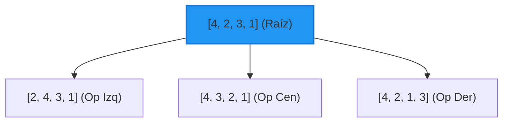

# Unidad 2: Métodos de Búsqueda y Algoritmos en Espacios de Estados Complejos

Esta unidad cubre algoritmos de búsqueda más avanzados, tanto informados como no informados, aplicados a puzzles lineales, itinerarios de vuelo, navegación terrestre con costo uniforme e incluso optimización discreta mediante backtracking.

---

## 1. Puzzle Lineal BFS

### 1.1 Objetivo
Resolver el rompecabezas de ordenamiento lineal de 4 dígitos (estado inicial `[4, 2, 3, 1]` a estado meta `[1, 2, 3, 4]`) utilizando el algoritmo de **Búsqueda en Anchura (BFS)** con operadores de movimiento adyacente, y mostrar los pasos secuenciales en una interfaz interactiva.

### 1.2 Fundamento Teórico
El problema consiste en ordenar una secuencia de números mediante operaciones permitidas de intercambios (*swaps*) entre elementos adyacentes. Definimos tres operaciones de intercambio:
- **Operador Izquierdo**: Intercambia los elementos en las posiciones 0 y 1.
- **Operador Central**: Intercambia los elementos en las posiciones 1 y 2.
- **Operador Derecho**: Intercambia los elementos en las posiciones 2 y 3.

BFS explora todos los estados posibles en orden de profundidad creciente (nivel por nivel), garantizando la solución con la menor cantidad posible de movimientos.



---

### 1.3 Estructura del Código

#### Backend / Algoritmo BFS (`BFS_puzzle.py` o integrado en `app.py`)
Utiliza la clase base `Nodo` importada de `arbol.py`.

```python
# Lógica de resolución en Python del puzzle lineal por BFS
from arbol import Nodo

def operador_izquierdo(estado):
    nuevo = estado.copy()
    nuevo[0], nuevo[1] = nuevo[1], nuevo[0]
    return nuevo

def operador_central(estado):
    nuevo = estado.copy()
    nuevo[1], nuevo[2] = nuevo[2], nuevo[1]
    return nuevo

def operador_derecho(estado):
    nuevo = estado.copy()
    nuevo[2], nuevo[3] = nuevo[3], nuevo[2]
    return nuevo

def buscar_solucion_BFS_puzzle(estado_inicial, solucion):
    nodos_visitados = []
    nodos_frontera = []
    nodoInicial = Nodo(estado_inicial)
    nodos_frontera.append(nodoInicial)

    while len(nodos_frontera) != 0:
        nodo = nodos_frontera.pop(0)
        nodos_visitados.append(nodo)
        
        if nodo.get_datos() == solucion:
            return nodo
        
        dato_nodo = nodo.get_datos()
        hijos_datos = [
            operador_izquierdo(dato_nodo),
            operador_central(dato_nodo),
            operador_derecho(dato_nodo)
        ]
        
        for un_hijo in hijos_datos:
            hijo = Nodo(un_hijo, padre=nodo)
            if not hijo.en_lista(nodos_visitados) and not hijo.en_lista(nodos_frontera):
                nodos_frontera.append(hijo)
    return None
```

#### Frontend (`puzzle-dashboard/index.html` & JS)
El dashboard se comunica localmente ejecutando la lógica de búsqueda en anchura directamente en JavaScript para animar la transición de las celdas en el navegador:

```javascript
// arbol.js de soporte
class Nodo {
    constructor(datos, padre = null) {
        this.datos = datos;
        this.padre = padre;
    }
    getString() { return this.datos.join(','); }
}

// Operadores en Javascript
function operadorIzquierdo(estado) {
    let nuevo = [...estado];
    [nuevo[0], nuevo[1]] = [nuevo[1], nuevo[0]];
    return nuevo;
}
function operadorCentral(estado) {
    let nuevo = [...estado];
    [nuevo[1], nuevo[2]] = [nuevo[2], nuevo[1]];
    return nuevo;
}
function operadorDerecho(estado) {
    let nuevo = [...estado];
    [nuevo[2], nuevo[3]] = [nuevo[3], nuevo[2]];
    return nuevo;
}

// Búsqueda en el Frontend (script.js)
function buscarSolucionBFS(estadoInicial, solucionMeta) {
    const solucionStr = solucionMeta.join(',');
    let nodosVisitados = new Set();
    let nodosFrontera = [new Nodo(estadoInicial)];
    nodosVisitados.add(estadoInicial.join(','));

    while (nodosFrontera.length > 0) {
        let nodo = nodosFrontera.shift();
        if (nodo.getString() === solucionStr) return nodo;
        
        let hijos = [
            operadorIzquierdo(nodo.datos),
            operadorCentral(nodo.datos),
            operadorDerecho(nodo.datos)
        ];
        for (let hijo of hijos) {
            let sHijo = hijo.join(',');
            if (!nodosVisitados.has(sHijo)) {
                nodosVisitados.add(sHijo);
                nodosFrontera.push(new Nodo(hijo, nodo));
            }
        }
    }
    return null;
}
```

---

## 2. Vuelos BPI (Búsqueda de Profundidad Iterativa / IDDFS)

### 2.1 Objetivo
Diseñar y programar un buscador de vuelos con escalas entre aeropuertos mexicanos aplicando la estrategia de **Búsqueda con Profundidad Iterativa (BPI)**, para conjugar las ventajas de BFS (optimalidad y completitud) y DFS (bajo consumo de memoria).

### 2.2 Fundamento Teórico
La **Búsqueda de Profundidad Iterativa (IDDFS)** resuelve las debilidades de la búsqueda en profundidad (DFS) estándar evitando que se pierda en ramas infinitas. El algoritmo funciona ejecutando repetidamente una búsqueda en profundidad limitada (`limite`), incrementando la profundidad máxima permitida de 1 en 1 en cada iteración.
- Si hay una solución a nivel $d$, se encontrará garantizando que es la más cercana a la raíz.
- Su consumo de memoria es $O(b \cdot d)$ (donde $b$ es el factor de ramificación y $d$ la profundidad de la meta), mucho menor que el $O(b^d)$ de BFS.

---

### 2.3 Estructura del Código

#### Módulo en Python (`Vuelos_BPI.py`)
```python
# Vuelos_BPI.py
# Vuelos con Búsqueda de profundidad Iterativa (BPI / IDDFS)
from arbol import Nodo

conexiones = {
    'Jiloyork': {'Celaya', 'CDMX', 'Querétaro'},
    'Sonora': {'Zacatecas', 'Sinaloa'},
    'Guanajuato': {'Aguascalientes'},
    'Oaxaca': {'Querétaro'},
    'Sinaloa': {'Celaya', 'Sonora', 'Jiloyork'},
    'Querétaro': {'Monterrey', 'Tamaulipas', 'Zacatecas', 'Sinaloa', 'Jiloyork', 'Oaxaca'},
    'Celaya': {'Jiloyork', 'Sinaloa'},
    'Zacatecas': {'Sonora', 'Monterrey', 'Querétaro'},
    'Monterrey': {'Zacatecas', 'Sinaloa'},
    'Tamaulipas': {'Querétaro'}
}

def DFS_prof_iter(nodo, solucion):
    # Iteración sobre los límites de profundidad de forma progresiva
    for limite in range(0, 100):
        visitados = []
        sol = buscar_solucion_DFS_Rec(nodo, solucion, visitados, limite)
        if sol != None:
            return sol
    return None
        
def buscar_solucion_DFS_Rec(nodo, solucion, visitados, limite):
    if limite > 0:
        visitados.append(nodo)
        if nodo.get_datos() == solucion:
            return nodo
        else:
            # Expandir nodos hijo
            dato_nodo = nodo.get_datos()
            lista_hijos = []
            if dato_nodo in conexiones:
                for un_hijo in conexiones[dato_nodo]:
                    hijo = Nodo(un_hijo)
                    if not hijo.en_lista(visitados):
                        lista_hijos.append(hijo)
            
            nodo.set_hijos(lista_hijos)

            for nodo_hijo in nodo.get_hijos():
                if not nodo_hijo.get_datos() in [v.get_datos() for v in visitados]:
                    # Llamada recursiva disminuyendo el límite en 1
                    sol = buscar_solucion_DFS_Rec(nodo_hijo, solucion, visitados, limite-1)
                    if sol != None:
                        # Relacionar la jerarquía de regreso para el trazado del camino
                        nodo_hijo.padre = nodo
                        return sol
    return None

if __name__ == "__main__":
    estado_inicial = 'Jiloyork'
    solucion = 'Oaxaca'
    nodo_inicial = Nodo(estado_inicial)
    nodo = DFS_prof_iter(nodo_inicial, solucion)

    if nodo != None:
        resultado = []
        while nodo.get_padre() != None:
            resultado.append(nodo.get_datos())
            nodo = nodo.get_padre()
        resultado.append(estado_inicial)
        resultado.reverse()
        print("Trayectoria de Vuelo encontrada (BPI):")
        print(" -> ".join(resultado))
    else:
        print("Solución no Encontrada")
```

---

## 3. Carretera USC (Uniform Cost Search - Búsqueda de Costo Uniforme)

### 3.1 Objetivo
Determinar la ruta óptima de menor distancia en kilómetros reales acumulados entre dos ciudades de México aplicando el algoritmo de **Búsqueda de Costo Uniforme (UCS)** sobre un mapa vial ponderado.

### 3.2 Fundamento Teórico
La **Búsqueda de Costo Uniforme (UCS)**, también conocida como algoritmo de Dijkstra en teoría de grafos, busca en amplitud dando prioridad a los caminos con menores costos acumulados. En lugar de extraer el primer elemento insertado en la frontera, UCS selecciona y expande el nodo con menor valor en la función de costo:
$$g(n) = \text{Costo acumulado desde el inicio hasta el nodo } n$$

Se implementa ordenando la lista frontera por el costo acumulado de menor a mayor en cada paso. Es óptimo y completo siempre que los costos de las aristas sean positivos.

---

### 3.3 Estructura del Código

#### Módulo en Python (`Carretera_UCS.py`)
```python
# Carretera_UCS.py
# Viaje por carretera con búsqueda de costo uniforme (UCS)
from arbol import Nodo

# Conexiones con sus distancias físicas reales (costos)
conexiones = {
    'JILOYORK': {'CDMX': 125, 'QRO': 513},
    'MORELOS': {'QRO': 524},
    'CDMX': {'JILOYORK': 125, 'QRO': 423, 'HGO': 491},
    'HGO': {'CDMX': 491, 'QRO': 356, 'MEXICALI': 109, 'MONTERREY': 346},
    'QRO': {
        'SLP': 203, 'MORELOS': 514, 'JILOYORK': 513, 'CDMX': 423,
        'MONTERREY': 603, 'SONORA': 437, 'HGO': 356, 'MEXICALI': 313,
        'AGUASCALIENTES': 599
    },
    'SLP': {'AGUASCALIENTES': 399, 'QRO': 203},
    'AGUASCALIENTES': {'SLP': 390, 'QRO': 599},
    'SONORA': {'QRO': 437, 'MEXICALI': 394},
    'MEXICALI': {'MONTERREY': 296, 'HGO': 309, 'QRO': 313},
    'MONTERREY': {'MEXICALI': 296, 'QRO': 603, 'HGO': 346}
}

def buscar_solucion_UCS(estado_inicial, solucion):
    nodos_visitados = []
    nodos_frontera = []
    
    nodo_inicial = Nodo(estado_inicial)
    nodo_inicial.set_costo(0)
    nodos_frontera.append(nodo_inicial)

    while len(nodos_frontera) > 0:
        # Ordenar por costo acumulado g(n) (Lógica de prioridad UCS)
        nodos_frontera = sorted(nodos_frontera, key=lambda x: x.costo)
        
        # Extraer el nodo con menor costo acumulado
        nodo = nodos_frontera.pop(0)
        nodos_visitados.append(nodo.get_datos())
        
        if nodo.get_datos() == solucion:
            return nodo
        else:
            dato_nodo = nodo.get_datos()
            if dato_nodo in conexiones:
                lista_hijos = []
                for un_hijo, costo in conexiones[dato_nodo].items():
                    hijo = Nodo(un_hijo, nodo)
                    hijo.set_costo(nodo.costo + costo)
                    
                    if un_hijo not in nodos_visitados:
                        # Si ya existe en la frontera, evaluar si el nuevo camino es más barato
                        en_frontera = False
                        for n in nodos_frontera:
                            if n.get_datos() == un_hijo:
                                en_frontera = True
                                if n.costo > hijo.costo:
                                    nodos_frontera.remove(n)
                                    nodos_frontera.append(hijo)
                                break
                        
                        if not en_frontera:
                            nodos_frontera.append(hijo)
                            lista_hijos.append(hijo)
                
                nodo.set_hijos(lista_hijos)
    return None

if __name__ == "__main__":
    origen = 'JILOYORK'
    destino = 'SLP'
    nodo_sol = buscar_solucion_UCS(origen, destino)
    if nodo_sol:
        resultado = []
        nodo = nodo_sol
        while nodo:
            resultado.append(nodo.get_datos())
            nodo = nodo.get_padre()
        resultado.reverse()
        print(f"Ruta óptima (UCS): {resultado}")
        print(f"Distancia Total: {nodo_sol.costo} km")
    else:
        print("No se encontró solución")
```

---

## 4. Puzzle Heurística (Piezas Fuera de Lugar)

### 4.1 Objetivo
Implementar una solución heurística óptima para ordenar un puzzle lineal de 4 posiciones, utilizando una función heurística de **piezas fuera de lugar** para acelerar drásticamente la velocidad de resolución en comparación con las búsquedas no informadas.

### 4.2 Fundamento Teórico
La **Búsqueda Heurística** (o Búsqueda Preferente por lo Mejor) utiliza conocimientos específicos del problema para guiar el recorrido de expansión de nodos. La función de evaluación asigna una prioridad a cada nodo basada en la heurística:
$$h(n) = \text{Número de dígitos que no se encuentran en su posición objetivo final.}$$

Esta heurística es admisible porque cada pieza fuera de su lugar requiere por lo menos un movimiento de intercambio (swap) para reubicarse, por lo que nunca sobreestima el costo real para resolver el rompecabezas. Se emplea una cola de prioridad (`heapq` en Python) para expandir primero los estados con menor desorden estimado.

---

### 4.3 Estructura del Código

#### Módulo en Python (`puzzleLinealHeuistico.py`)
```python
# puzzleLinealHeuistico.py
# Búsqueda heurística basada en la cantidad de piezas fuera de lugar
from arbol import Nodo
import heapq

def heuristic(estado, estado_final):
    # Distancia heurística: contar cuántos números no coinciden con la meta
    distancia = 0
    for i in range(len(estado)):
        if estado[i] != estado_final[i]:
            distancia += 1
    return distancia

def buscar_solucion_heuristica(nodo_inicial, estado_final):
    visitados = set()
    
    # Priority Queue: (prioridad, contador_unico, nodo)
    counter = 0
    prioridad_inicial = heuristic(nodo_inicial.get_datos(), estado_final)
    queue = [(prioridad_inicial, counter, nodo_inicial)]
    
    visitados.add(tuple(nodo_inicial.get_datos()))
    
    while queue:
        # Extraer el nodo con menor costo heurístico estimado h(n)
        prioridad, _, nodo_actual = heapq.heappop(queue)
        
        if nodo_actual.get_datos() == estado_final:
            return nodo_actual
        
        dato_nodo = nodo_actual.get_datos()
        
        # Generar posibles hijos mediante swaps adyacentes
        hijos_datos = [
            [dato_nodo[1], dato_nodo[0], dato_nodo[2], dato_nodo[3]], # swap 0-1
            [dato_nodo[0], dato_nodo[2], dato_nodo[1], dato_nodo[3]], # swap 1-2
            [dato_nodo[0], dato_nodo[1], dato_nodo[3], dato_nodo[2]]  # swap 2-3
        ]

        lista_hijos = []
        for h_dato in hijos_datos:
            if tuple(h_dato) not in visitados:
                visitados.add(tuple(h_dato))
                hijo_nodo = Nodo(h_dato, padre=nodo_actual)
                lista_hijos.append(hijo_nodo)
                
                # Calcular la prioridad con la función heurística
                h_val = heuristic(h_dato, estado_final)
                counter += 1
                heapq.heappush(queue, (h_val, counter, hijo_nodo))
        
        nodo_actual.set_hijos(lista_hijos)
        
    return None

if __name__ == "__main__":
    estado_inicial = [4, 3, 2, 1]
    estado_final = [1, 2, 3, 4]
    
    nodo_inicial = Nodo(estado_inicial)
    solucion = buscar_solucion_heuristica(nodo_inicial, estado_final)
    
    if solucion is not None:
        print("Solución heurística encontrada:")
        resultado = []
        nodo = solucion
        while nodo is not None:
            resultado.append(nodo.get_datos())
            nodo = nodo.get_padre()
        resultado.reverse()
        print("Pasos: ", resultado)
        print(f"Número total de pasos: {len(resultado) - 1}")
    else:
        print("No se encontró solución")
```

---

## 5. PLE Backtracking (Programación Lineal Entera)

### 5.1 Objetivo
Implementar un optimizador de Programación Lineal Entera (PLE) utilizando el método de **Búsqueda en Profundidad con Retroceso (Backtracking)** y poda por cota de factibilidad para maximizar el beneficio de producción respetando los límites estrictos de recursos de la planta.

### 5.2 Fundamento Teórico
El problema modela una función objetivo de maximización sujeta a restricciones de recursos lineales:
$$\text{Maximizar } Z = b_1 \cdot x_1 + b_2 \cdot x_2$$
Sujeto a:
$$c_{11} \cdot x_1 + c_{12} \cdot x_2 \le L_1$$
$$c_{21} \cdot x_1 + c_{22} \cdot x_2 \le L_2$$
$$x_1, x_2 \ge 0 \quad (\text{Enteros dentro de un rango predefinido})$$

La búsqueda por **Backtracking** recorre sistemáticamente las combinaciones válidas en forma de árbol de profundidad. En lugar de evaluar todo el espacio de estados:
1. Asigna recursivamente un valor a $x_i$.
2. Valida de inmediato si la combinación parcial sigue siendo factible.
3. Si excede alguno de los límites $L_1, L_2$, detiene la exploración en ese nivel (**poda** el subárbol) y retrocede al nivel anterior (hace *backtrack*) para modificar la variable previa, ahorrando tiempo de procesamiento exponencial.

---

### 5.3 Estructura del Código

#### Módulo en Python (`dfs_backtraking.py`)
```python
# dfs_backtraking.py
# Optimización mediante backtracking (Búsqueda en espacio de estados con poda)

class BacktrackingOptimizer:
    def __init__(self, ranges=None, beneficios=(6, 4), limites=(150, 160), coefs=((7, 4), (6, 5))):
        self.mejor_val = -1
        self.mejor_sol = None
        self.rango_variables = ranges if ranges else [(0, 50), (0, 75)]
        self.beneficios = beneficios
        self.limites = limites
        self.coefs = coefs
        self.error_detail = None

    def es_completable(self, variables):
        x1, x2 = variables
        # Comprobar restricciones del sistema
        val1 = self.coefs[0][0] * x1 + self.coefs[0][1] * x2
        val2 = self.coefs[1][0] * x1 + self.coefs[1][1] * x2
        
        if val1 > self.limites[0]:
            self.error_detail = f"Recurso A excedido ({val1} > {self.limites[0]})"
            return False
        if val2 > self.limites[1]:
            self.error_detail = f"Recurso B excedido ({val2} > {self.limites[1]})"
            return False
        return True

    def evalua_solucion(self, variables):
        x1, x2 = variables
        return self.beneficios[0] * x1 + self.beneficios[1] * x2

    def resolver(self, variables, profundidad):
        # Condición de parada: se han asignado todas las variables
        if profundidad == len(variables):
            val = self.evalua_solucion(variables)
            if val > self.mejor_val:
                self.mejor_val = val
                self.mejor_sol = list(variables)
            return

        min_val, max_val = self.rango_variables[profundidad]
        for v in range(int(min_val), int(max_val) + 1):
            # Hacer una copia local de las variables asignadas
            nuevas_variables = list(variables)
            nuevas_variables[profundidad] = v
            
            # Poda sistemática: si la solución parcial es factible, profundiza
            if self.es_completable(nuevas_variables):
                self.resolver(nuevas_variables, profundidad + 1)
            else:
                # Si con el valor mínimo ya falla o si excede restricciones, 
                # podamos toda la rama subsiguiente del ciclo
                break

def buscar_mejor_valor_backtracking(rangos=None, beneficios=(6, 4), limites=(150, 160), coefs=((7, 4), (6, 5))):
    opt = BacktrackingOptimizer(rangos, beneficios, limites, coefs)
    variables = [0, 0]
    opt.resolver(variables, 0)
    
    if opt.mejor_sol is None:
        return {
            "success": False,
            "error": "No hay solución factible.",
            "detalle": opt.error_detail or "Los rangos mínimos exceden los recursos."
        }

    return {
        "success": True,
        "x1": opt.mejor_sol[0],
        "x2": opt.mejor_sol[1],
        "z": opt.mejor_val
    }

if __name__ == "__main__":
    resultado = buscar_mejor_valor_backtracking()
    print("Resultado de Optimización PLE:")
    if resultado["success"]:
        print(f"Mejor combinación: x1 = {resultado['x1']}, x2 = {resultado['x2']}")
        print(f"Valor Máximo Z = {resultado['z']}")
    else:
        print("Error:", resultado["error"], resultado["detalle"])
```

---

### 2.4 Guía de Ejecución y Pruebas (Unidad 2)
1. Ejecute `python app.py` para levantar el panel interactivo de todos los resolvedores.
2. Pruebe el **Puzzle Lineal BFS** abriendo directamente el archivo de cliente `puzzle-dashboard/index.html` en un navegador web.
3. Pruebe **Vuelos BPI** y **Carretera UCS** desde las pestañas correspondientes de la aplicación local (`/vuelos` y `/carretera-ucs`).
4. Pruebe el resolvedor de **Backtracking** introduciendo coeficientes de rendimiento comercial e industrial, límites de capacidad operativa y presionando el botón "Optimizar con Backtracking" para verificar la asignación óptima de variables enteras.
