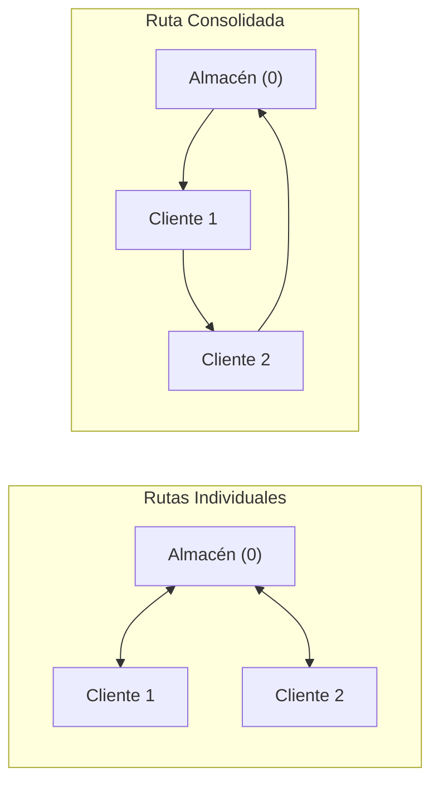

# Unidad 3: Búsqueda Informada Avanzada e Inteligencia Logística

Esta unidad detalla algoritmos heurísticos avanzados aplicados a problemas complejos de optimización espacial, logística industrial y distribución de transporte.

---

## 1. Carretera Costo Coords (Carretera A\*)

### 1.1 Objetivo
Resolver el problema de navegación de carreteras óptimas entre ciudades de México mediante el algoritmo de búsqueda informada **A\***, utilizando la **distancia geodésica** (cálculo de círculo máximo por latitud y longitud) como función heurística admisible $h(n)$ para reducir la cantidad de nodos explorados en la búsqueda.

### 1.2 Fundamento Teórico
El algoritmo A\* guía la búsqueda hacia el destino evaluando cada estado $n$ mediante una función de estimación total:
$$f(n) = g(n) + h(n)$$
- $g(n)$: El costo real acumulado para ir desde la ciudad de origen hasta la ciudad actual $n$ (distancia real en kilómetros viales).
- $h(n)$: La estimación optimista del costo restante hasta el destino final.

En este sistema, $h(n)$ se modela como la **distancia geodésica** (distancia en línea recta sobre la superficie de la esfera terrestre). Se calcula empleando la fórmula del Haversine a partir de coordenadas reales de latitud y longitud de cada estado. Al ser una distancia en línea recta, nunca sobreestima la distancia real por carretera, lo que garantiza que la heurística es **admisible** y, por lo tanto, el algoritmo es óptimo.

---

### 1.3 Estructura del Código

#### Módulo Matemático y de Búsqueda (`Carretera_Astar.py` & `DistanciasGeo.py`)
Reutiliza la estructura `Nodo` de `arbol.py`.

```python
# Carretera_Astar.py
# Viaje por carretera por búsqueda informada A* utilizando distancias geodésicas
from arbol import Nodo
from math import sin, cos, acos

# Distancias viales entre ciudades (g)
conexiones = {
    'Jiloyork':{'CDMX': 125, 'QRO':513},
    'MORELOS':{'QRO':524},
    'CDMX':{'Jiloyork': 125, 'QRO':423, 'HGO':491},
    'HGO':{'CDMX':491, 'QRO':356, 'MEXICALI':309, 'MTY':346},
    'QRO':{'SLP':203, 'MORELOS':514, 'Jiloyork':513, 'CDMX':423, 'MTY':603,\
            'SONORA':437, 'HGO':356, 'MEXICALI':313, 'AGS':599},
    'SLP':{'AGS':390, 'QRO':203},
    'AGS':{'SLP':390, 'QRO':599},
    'SONORA':{'QRO':437, 'MEXICALI':394},
    'MEXICALI':{'MTY':296, 'HGO':309, 'QRO':313},
    'MTY':{'MEXICALI':296, 'QRO':603, 'HGO':346}
}

# Coordenadas geográficas (latitud, longitud) para calcular h(n)
coord = {
    'Jiloyork':(19.952408902750292, -99.53304570197712),
    'CDMX':(19.432684900517486, -99.13333701698),
    'QRO':(20.587956563302367, -100.38793290667115),
    'MORELOS':(18.930555912984644, -99.22237799899486),
    'HGO':(20.127000042049925, -98.73156416258126),
    'AGS':(21.856150731885958, -102.28915655184271),
    'SLP':(22.151749211629454, -100.97643458591887),
    'SONORA':(29.07865856228773, -110.94760761628041),
    'MEXICALI':(29.07865856228773, -110.94760761628041),
    'MTY':(25.66616067388393, -100.32880810205152)
}

solucion = 'MTY' # Meta global inicializada para simplificación de interfaces

def geodist(lat1, lon1, lat2, lon2):
    # Fórmula de distancia geodésica sobre la curvatura terrestre
    grad_rad = 0.0174539
    rad_grad = 57.29577951
    longitud = lon1 - lon2
    val = (sin(lat1 * grad_rad) * sin(lat2 * grad_rad)) + (cos(lat1 * grad_rad) * cos(lat2 * grad_rad) * cos(longitud * grad_rad))
    val = max(-1.0, min(1.0, val)) # Acotación para evitar errores numéricos de precisión
    return (acos(val) * rad_grad) * 111.32

def buscar_solucion_USC(conexiones, estado_inicial, solucion):
    # Nota: El nombre buscar_solucion_USC se mantiene por compatibilidad del dashboard, pero implementa A* completo.
    def evalua(x):
        # f(n) = g(n) + h(n)
        lat1 = coord[x.get_datos()][0]
        lon1 = coord[x.get_datos()][1]
        lat2 = coord[solucion][0]
        lon2 = coord[solucion][1]
        d = int(geodist(lat1, lon1, lat2, lon2))
        return x.get_costo() + d

    solucionado = False
    nodos_visitados = []
    nodos_frontera = []
    nodo_inicial = Nodo(estado_inicial)
    nodo_inicial.set_costo(0)
    nodos_frontera.append(nodo_inicial)
    
    while (not solucionado) and len(nodos_frontera) != 0:
        # Ordenar frontera por f(n) = g(n) + h(n)
        nodos_frontera = sorted(nodos_frontera, key=evalua)
        nodo = nodos_frontera.pop(0)
        nodos_visitados.append(nodo)
        
        if nodo.get_datos() == solucion:
            solucionado = True
            return nodo
        else:
            dato_nodo = nodo.get_datos()
            lista_hijos = []
            if dato_nodo in conexiones:
                for un_hijo in conexiones[dato_nodo]:
                    hijo = Nodo(un_hijo, nodo)
                    costo_viaje = conexiones[dato_nodo][un_hijo]
                    hijo.set_costo(nodo.get_costo() + costo_viaje)
                    lista_hijos.append(hijo)
                    
                    if not hijo.en_lista(nodos_visitados):
                        en_frontera = False
                        for n in nodos_frontera:
                            if n.igual(hijo):
                                en_frontera = True
                                # Si el nuevo camino tiene menor g(n), actualizar
                                if n.get_costo() > hijo.get_costo():
                                    nodos_frontera.remove(n)
                                    nodos_frontera.append(hijo)
                                break
                        if not en_frontera:
                            nodos_frontera.append(hijo)
                
                nodo.set_hijos(lista_hijos)
    return None

if __name__ == "__main__":
    origen = 'Jiloyork'
    destino = 'MTY'
    solucion = destino
    print(f"Buscando camino A* de {origen} a {destino}...")
    sol = buscar_solucion_USC(conexiones, origen, destino)
    if sol:
        resultado = []
        nodo = sol
        while nodo:
            resultado.append(nodo.get_datos())
            nodo = nodo.get_padre()
        resultado.reverse()
        print("Ruta óptima A*:", resultado)
        print("Costo Total:", sol.get_costo(), "km")
```

---

## 2. A\* Llantas (Adjudicación Óptima de Ruedas)

### 2.1 Objetivo
Resolver el problema de selección y compra óptima de 4 tipos de ruedas industriales (`t`, `h`, `v`, `w`) a 4 empresas proveedoras diferentes con costo mínimo utilizando el algoritmo **A\***, asegurando que ninguna empresa sea adjudicada más de una vez.

### 2.2 Fundamento Teórico
El espacio de búsqueda consiste en asignar recursivamente una empresa proveedora a cada tipo de neumático secuencialmente. 
- **Estado**: Representado por una lista `[E1, E2, E3, E4]` donde la posición representa la rueda (`t`, `h`, `v`, `w`) y el valor la empresa asignada (o `None` si está pendiente).
- **Costo g(n)**: Costos acumulados de las compras asignadas hasta el momento en el nodo.
- **Heurística h(n)**: Estimación del costo de las ruedas faltantes. Para ser admisible, $h(n)$ calcula para cada rueda no asignada el costo mínimo posible seleccionando únicamente entre las empresas que aún no han sido adjudicadas en esa rama de búsqueda.

$$h(n) = \sum_{r \in \text{Ruedas no asignadas}} \min_{e \in \text{Empresas libres}} (\text{Costo de la rueda } r \text{ en la empresa } e)$$

Esta heurística es admisible (nunca sobreestima) y consistente, asegurando que A\* encuentre de inmediato la combinación de costos más baja del mercado sin redundancias de adjudicación.

---

### 2.3 Estructura del Código

#### Módulo en Python (`SeleccionRuedas_Astar.py`)
```python
# SeleccionRuedas_Astar.py
# Adjudicación de proveedores de ruedas utilizando búsqueda informada A*
from arbol import Nodo

TIPOS_RUEDA = ['t', 'h', 'v', 'w']
EMPRESAS = ['Empresa 1', 'Empresa 2', 'Empresa 3', 'Empresa 4']

MATRIZ_DEFECTO = {
    'Empresa 1': {'t': 20, 'h': 30, 'v': 20, 'w': 40},
    'Empresa 2': {'t': 50, 'h': 50, 'v': 40, 'w': 50},
    'Empresa 3': {'t': 60, 'h': 55, 'v': 50, 'w': 60},
    'Empresa 4': {'t': 100, 'h': 80, 'v': 60, 'w': 70}
}

def calcular_h(estado, matriz):
    # Encontrar qué empresas ya han sido asignadas
    empresas_asignadas = set(emp for emp in estado if emp is not None)
    
    # Filtrar empresas libres
    empresas_libres = [emp for emp in EMPRESAS if emp not in empresas_asignadas]
    
    if not empresas_libres:
        return 0, []
        
    h_total = 0
    detalles = []
    
    # Para cada rueda pendiente de asignar, calcular el precio más bajo en las empresas libres
    for i in range(len(TIPOS_RUEDA)):
        if estado[i] is None:
            tipo_rueda = TIPOS_RUEDA[i]
            precio_min = float('inf')
            empresa_min = None
            
            for emp in empresas_libres:
                precio = matriz[emp][tipo_rueda]
                if precio < precio_min:
                    precio_min = precio
                    empresa_min = emp
            
            if empresa_min is not None:
                h_total += precio_min
                detalles.append({'wheel': tipo_rueda, 'min_price': precio_min, 'company': empresa_min})
                
    return h_total, detalles

def resolver_seleccion_ruedas(matriz=None):
    if matriz is None:
        matriz = MATRIZ_DEFECTO
        
    id_contador = 0
    estado_inicial = [None, None, None, None]
    
    nodo_raiz = Nodo(estado_inicial)
    nodo_raiz.set_costo(0)
    nodo_raiz.id = f"n{id_contador}"
    id_contador += 1
    
    h_raiz, h_detalles_raiz = calcular_h(estado_inicial, matriz)
    nodo_raiz.h = h_raiz
    nodo_raiz.h_detalles = h_detalles_raiz
    nodo_raiz.f = nodo_raiz.get_costo() + nodo_raiz.h
    nodo_raiz.depth = 0
    
    frontera = [nodo_raiz]
    visitados = []
    pasos = []
    nodo_solucion = None
    paso_num = 0
    
    def nodo_a_dict(nodo):
        return {
            'id': nodo.id,
            'state': nodo.get_datos(),
            'parent_id': nodo.get_padre().id if nodo.get_padre() else None,
            'g': nodo.get_costo(),
            'h': nodo.h,
            'f': nodo.f,
            'depth': nodo.depth
        }
        
    while len(frontera) > 0:
        paso_num += 1
        # Ordenar por f(n) ascendente; desempatar con mayor profundidad
        frontera.sort(key=lambda x: (x.f, -x.depth))
        
        nodo_actual = frontera.pop(0)
        visitados.append(nodo_actual)
        
        registro_paso = {
            'step_number': paso_num,
            'expanded_node': nodo_a_dict(nodo_actual),
            'children': [],
            'frontier': [nodo_a_dict(n) for n in frontera]
        }
        
        if nodo_actual.depth == 4:
            nodo_solucion = nodo_actual
            pasos.append(registro_paso)
            break
            
        rueda_por_asignar = TIPOS_RUEDA[nodo_actual.depth]
        empresas_ocupadas = set(emp for emp in nodo_actual.get_datos() if emp is not None)
        empresas_disponibles = [emp for emp in EMPRESAS if emp not in empresas_ocupadas]
        
        hijos_nodos = []
        for emp in empresas_disponibles:
            nuevo_estado = list(nodo_actual.get_datos())
            nuevo_estado[nodo_actual.depth] = emp
            
            nodo_hijo = Nodo(nuevo_estado, padre=nodo_actual)
            nodo_hijo.id = f"n{id_contador}"
            id_contador += 1
            
            costo_g = nodo_actual.get_costo() + matriz[emp][rueda_por_asignar]
            nodo_hijo.set_costo(costo_g)
            
            h_hijo, h_detalles_hijo = calcular_h(nuevo_estado, matriz)
            nodo_hijo.h = h_hijo
            nodo_hijo.h_detalles = h_detalles_hijo
            nodo_hijo.f = costo_g + h_hijo
            nodo_hijo.depth = nodo_actual.depth + 1
            
            hijos_nodos.append(nodo_hijo)
            
            ya_visitado = False
            for v in visitados:
                if v.get_datos() == nuevo_estado:
                    ya_visitado = True
                    break
                    
            if not ya_visitado:
                en_frontera_idx = -1
                for idx, f_node in enumerate(frontera):
                    if f_node.get_datos() == nuevo_estado:
                        en_frontera_idx = idx
                        break
                        
                if en_frontera_idx == -1:
                    frontera.append(nodo_hijo)
                else:
                    if frontera[en_frontera_idx].get_costo() > costo_g:
                        frontera.pop(en_frontera_idx)
                        frontera.append(nodo_hijo)
                        
        nodo_actual.set_hijos(hijos_nodos)
        registro_paso['children'] = [nodo_a_dict(n) for n in hijos_nodos]
        pasos.append(registro_paso)
        
    camino = []
    if nodo_solucion is not None:
        n = nodo_solucion
        while n is not None:
            camino.append(nodo_a_dict(n))
            n = n.get_padre()
        camino.reverse()
        
    return {
        'success': nodo_solucion is not None,
        'path': camino,
        'steps': pasos,
        'total_cost': nodo_solucion.get_costo() if nodo_solucion else 0
    }

if __name__ == "__main__":
    res = resolver_seleccion_ruedas()
    print("Éxito:", res['success'])
    print("Costo Óptimo de Asignación:", res['total_cost'])
    print("Asignaciones óptimas:")
    for paso in res['path']:
        if paso['depth'] > 0:
            rueda = TIPOS_RUEDA[paso['depth'] - 1]
            empresa = paso['state'][paso['depth'] - 1]
            print(f"  Rueda {rueda} -> Adjudicada a {empresa}")
```

---

## 3. VRP Voraz (Vehicle Routing Problem)

### 3.1 Objetivo
Resolver el Problema de Enrutamiento de Vehículos (VRP) con capacidad de carga limitada, aplicando el **Algoritmo de Ahorros de Clarke y Wright** para consolidar los despachos logísticos de pedidos desde un almacén central hacia múltiples clientes en rutas óptimas.

### 3.2 Fundamento Teórico
El **Algoritmo de Ahorros de Clarke y Wright** es una de las heurísticas más exitosas para resolver el VRP. El método parte del supuesto de que inicialmente cada cliente es abastecido por una ruta exclusiva que viaja de ida y vuelta desde el almacén ($0$). El costo total inicial de transporte es la suma de los viajes individuales.

Si consolidamos al cliente $i$ y al cliente $j$ en una sola ruta secuencial, el ahorro de distancia obtenido es:
$$S(i, j) = d(i, 0) + d(j, 0) - d(i, j)$$



El algoritmo procede de la siguiente manera:
1. Calcular la matriz de ahorros para todos los pares de clientes.
2. Ordenar los ahorros de mayor a menor.
3. Evaluar de forma secuencial la lista de ahorros para fusionar rutas individuales, sujeto a:
   - Que los clientes pertenezcan a rutas diferentes y sean exteriores (primero o último de sus respectivas rutas).
   - Que la carga total combinada no supere la **Capacidad Máxima** del vehículo.
4. Cualquier cliente no asignado se atiende mediante una ruta individual exclusiva.

---

### 3.3 Estructura del Código

#### Módulo en Python (`BRP_boraz.py`)
```python
# BRP_boraz.py
# Implementación de Clarke and Wright Savings Algorithm para Ruteo de Vehículos (VRP)
from Carretera_Astar import coord
import math
from operator import itemgetter

def distancia(coord1, coord2):
    # Distancia euclidiana entre coordenadas
    lat1 = coord1[0]
    lon1 = coord1[1]
    lat2 = coord2[0]
    lon2 = coord2[1]
    return math.sqrt((lat1-lat2)**2 + (lon1-lon2)**2)

def en_ruta(rutas, cliente):
    for n in rutas:
        if cliente in n:
            return n
    return None

def peso_ruta(ruta, pedidos):
    total = 0 
    for c in ruta:
        if c in pedidos:
            total += pedidos[c]
    return total

def vrp_voraz(pedidos, almacen, max_carga):
    s = {}
    clientes = list(pedidos.keys())
    
    # 1. Calcular ahorros
    for c1 in clientes:
        for c2 in clientes:
            if c1 != c2:
                if not (c1, c2) in s and not (c2, c1) in s:
                    d_c1_c2 = distancia(coord[c1], coord[c2])
                    d_c1_almacen = distancia(coord[c1], coord[almacen])
                    d_c2_almacen = distancia(coord[c2], coord[almacen])
                    s[(c1, c2)] = d_c1_almacen + d_c2_almacen - d_c1_c2
                    
    # 2. Ordenar los ahorros en orden descendente
    s = sorted(s.items(), key=itemgetter(1), reverse=True)

    # 3. Construir Rutas
    rutas = []
    pasos = []
    for k, v in s:
        rc1 = en_ruta(rutas, k[0])
        rc2 = en_ruta(rutas, k[1])
        
        if rc1 is None and rc2 is None:
            # Regla 1: Ambos clientes están libres
            if peso_ruta([k[0], k[1]], pedidos) <= max_carga:
                rutas.append([k[0], k[1]])
                pasos.append(f"Regla 1: Nueva ruta creada con {k[0]} y {k[1]} (Ahorro: {v:.2f}).")
        elif rc1 is not None and rc2 is None:
            # Regla 2: Uno está en ruta, el otro no
            if rc1[0] == k[0]:
                if peso_ruta(rc1, pedidos) + peso_ruta([k[1]], pedidos) <= max_carga:
                    rutas[rutas.index(rc1)].insert(0, k[1])
                    pasos.append(f"Regla 2: Insertado {k[1]} al inicio de la ruta {rc1} (Ahorro: {v:.2f}).")
            elif rc1[-1] == k[0]:
                if peso_ruta(rc1, pedidos) + peso_ruta([k[1]], pedidos) <= max_carga:
                    rutas[rutas.index(rc1)].append(k[1])
                    pasos.append(f"Regla 2: Añadido {k[1]} al final de la ruta {rc1} (Ahorro: {v:.2f}).")
        elif rc1 is None and rc2 is not None:
            # Regla 2 equivalente
            if rc2[0] == k[1]:
                if peso_ruta(rc2, pedidos) + peso_ruta([k[0]], pedidos) <= max_carga:
                    rutas[rutas.index(rc2)].insert(0, k[0])
                    pasos.append(f"Regla 2: Insertado {k[0]} al inicio de la ruta {rc2} (Ahorro: {v:.2f}).")
            elif rc2[-1] == k[1]:
                if peso_ruta(rc2, pedidos) + peso_ruta([k[0]], pedidos) <= max_carga:
                    rutas[rutas.index(rc2)].append(k[0])
                    pasos.append(f"Regla 2: Añadido {k[0]} al final de la ruta {rc2} (Ahorro: {v:.2f}).")
        elif rc1 is not None and rc2 is not None and rc1 != rc2:
            # Regla 3: Ambos en rutas diferentes, unir si son extremos
            if rc1[0] == k[0] and rc2[-1] == k[1]:
                if peso_ruta(rc1, pedidos) + peso_ruta(rc2, pedidos) <= max_carga:
                    rutas[rutas.index(rc2)].extend(rc1)
                    rutas.remove(rc1)
                    pasos.append(f"Regla 3: Unificadas rutas de {k[1]} y {k[0]} (Ahorro: {v:.2f}).")
            elif rc1[-1] == k[0] and rc2[0] == k[1]:
                if peso_ruta(rc1, pedidos) + peso_ruta(rc2, pedidos) <= max_carga:
                    rutas[rutas.index(rc1)].extend(rc2)
                    rutas.remove(rc2)
                    pasos.append(f"Regla 3: Unificadas rutas de {k[0]} y {k[1]} (Ahorro: {v:.2f}).")
                    
    # Regla 4: Clientes aislados restantes reciben su propia ruta individual
    for c in clientes:
        if en_ruta(rutas, c) is None:
            if peso_ruta([c], pedidos) <= max_carga:
                rutas.append([c])
                pasos.append(f"Regla 4: Cliente {c} aislado. Ruta directa asignada.")
        
    return rutas, pasos

if __name__ == "__main__":
    pedidos_test = {
        'CDMX': 10,
        'QRO': 15,
        'SLP': 8,
        'AGS': 12,
        'SONORA': 5
    }
    almacen_test = 'Jiloyork'
    capacidad_vehiculo = 30
    
    print(f"Calculando VRP voraz con capacidad máxima = {capacidad_vehiculo}...")
    rutas_res, logs = vrp_voraz(pedidos_test, almacen_test, capacidad_vehiculo)
    
    print("\nPasos de consolidación ejecutados:")
    for log in logs:
        print(" -", log)
        
    print("\nRutas óptimas de despacho resultantes:")
    for idx, ruta in enumerate(rutas_res):
        carga = peso_ruta(ruta, pedidos_test)
        print(f" Vehículo {idx + 1}: {almacen_test} -> " + " -> ".join(ruta) + f" -> {almacen_test} (Carga: {carga}/{capacidad_vehiculo})")
```

---

### 3.4 Guía de Ejecución y Pruebas (Unidad 3)
1. Ejecute el servidor Flask (`python app.py`).
2. Acceda a la pestaña **Carretera A\*** (`/carretera-astar`) y asigne un punto de origen y un punto de destino. Presione el botón de ejecución y analice el trazado en pantalla.
3. Vaya al adjudicador de **Selección de Ruedas** (`/seleccion-ruedas`), configure a su preferencia los precios que ofrece cada empresa proveedora para cada tipo de rueda y presione **Calcular Compra Óptima**. Observe el árbol A\* y los valores $g, h, f$ calculados para cada nodo.
4. Diríjase al planificador de despacho **VRP Voraz** (`/brp-voraz`), defina las cargas de pedidos de cada ciudad, configure la capacidad de almacenamiento de los camiones de reparto y presione **Calcular Plan de Reparto**. Compruebe la agrupación óptima bajo las reglas de Clarke y Wright.
